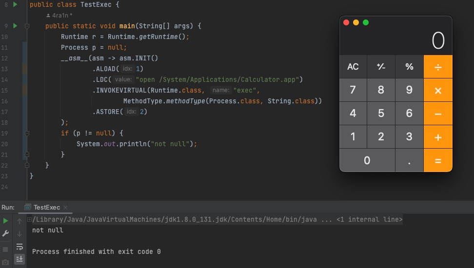

## \_\_asm\_\_


A Java Library that allows inline ASM in Java Code.

Note: 
- This ASM is not x86/ARM ASM, but JVM Instruction
- Only support Java 8



## Get

Add Maven repository:
```xml
<repositories>
    <repository>
        <id>jitpack.io</id>
        <url>https://jitpack.io</url>
    </repository>
</repositories>
```

Get:
```xml
<dependency>
    <groupId>com.github.4ra1n</groupId>
    <artifactId>__asm__</artifactId>
    <version>0.0.1</version>
</dependency>
```

## Quick Start

(1) Hello World:

```java
import java.io.PrintStream;
import java.lang.invoke.MethodType;

import static org.sec.asm.core.ASM.__asm__;

public class TestHello {
    public static void main(String[] args) {
        System.out.println("test __asm__");
        __asm__(asm -> asm.INIT()
                .GETSTATIC(System.class, "out", PrintStream.class)
                .LDC("hello world!")
                .INVOKEVIRTUAL(PrintStream.class, "println",
                        MethodType.methodType(Void.TYPE, String.class)));
        System.out.println("test end");
    }
}
```

You will see this output when first run:

```text
|----------------ASM----------------|
|  Please Restart Java Application  |
|-----------------------------------|
```

And restart:

```text
test __asm__
hello world!
test end
```

(2) Instantiate

```java
public class TestArray {
    public static void main(String[] args) {
        int[] arr = null;
        __asm__(asm -> asm.INIT()
                .ICONST_3()
                .NEWARRAY(T_INT)
                .ASTORE(1)
                .ALOAD(1)
                .ICONST_0()
                .ICONST_1()
                .IASTORE());
        System.out.println(arr[0]);
    }
}
```

Run twice and the console:

```text
1
```

(3) How to solve return value

```java
public class TestExec {
    public static void main(String[] args) {
        Runtime r = Runtime.getRuntime();
        Process p = null;
        __asm__(asm -> asm.INIT()
                .ALOAD(1)
                .LDC("open /System/Applications/Calculator.app")
                .INVOKEVIRTUAL(Runtime.class, "exec",
                        MethodType.methodType(Process.class, String.class))
                .ASTORE(2)
        );
        if (p != null) {
            System.out.println("not null");
        }
    }
}
```

Why should we use `ASTORE 2` to solve return in the end:

Operand Stack after invoke:

```text
┌──────────────────┐
│  Process Return  │  TOP
├──────────────────┤
│       ...        │
├──────────────────┤
│       ...        │
├──────────────────┤
│       ...        │
└──────────────────┘
```

Local Variables after invoke:

```text
┌─────────────────┬──────────────┬────────────────────┬───────┐
│        0        │      1       │         2          │  ...  │
├─────────────────┼──────────────┼────────────────────┼───────┤
│  String[] args  │  Runtime rt  │  Process -> null   │  ...  │
└─────────────────┴──────────────┴────────────────────┴───────┘
```

We can use `ASTORE 2` to save Process return ref to Process p ptr of local variables.

(4) Junk code:

```java
public class TestExec {
    public static void main(String[] args) {
        Runtime r = Runtime.getRuntime();
        Process p = null;
        __asm__(asm -> asm.INIT()
                .ALOAD(1)
                .LDC("open /System/Applications/Calculator.app")
                .INVOKEVIRTUAL(Runtime.class, "exec",
                        MethodType.methodType(Process.class, String.class))
                .DUP()
                .POP()
                .ALOAD(0)
                .ASTORE(3)
                .ASTORE(2)
        );
        if (p != null) {
            System.out.println("not null");
        }
    }
}
```

We can add some junk code, but run normally. Have fun.

## Thanks

The core code is from: https://github.com/xxDark/asm-inline

Its code is a little hard to understand and cannot be run directly.
So I simplify and refactor on the basis of this code, then make this project.